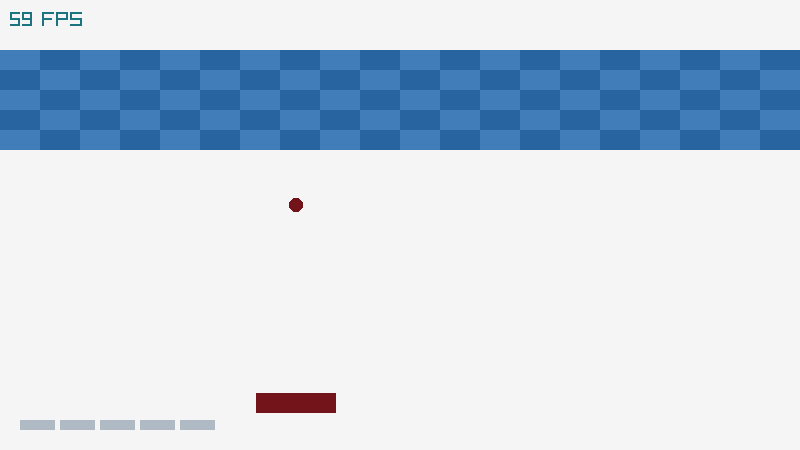

# Graphics Programming
This repo contains some challenges about Graphics Programming. Challenges are organized in folders and include the solutions. They are intended to be used as tutorials to learn graphics programming for videogames development.

Some of those challenges are based on [raylib](http://www.raylib.com/), a simple and easy-to-use library to enjoy videogames programming.

## [Challenge 01. Blocks game](01_challenge_blocks#challenge-01-blocks-game)

A blocks game where player has to break a wall of blocks controlling a ball with a paddle.

This game is developed using [raylib](http://www.raylib.com/) library.

**Learning outcomes:**
 - raylib functionality and possibilities
 - Videogame life cycle (Init -> Update -> Draw -> DeInit)
 - Basic screens management with screens transition
 - Basic shapes drawing (circle, rectangle)
 - Inputs management (keyboard, mouse)
 - Collision detection and resolution
 - Textures loading and drawing
 - Fonts loading and text drawing
 - Sounds and music loading and playing

## [Challenge 02. Dungeon 2D game](02_challenge_dungeon2d#challenge-02-2d-dungeon-game)

A tile-based dungeon 2D game where player moves around a 2D dungeon finding keys and defeating monsters.

This game is developed using raylib [rlgl](https://github.com/raysan5/raylib/blob/develop/src/rlgl.c) low-level library module.

**Learning outcomes:**
 - rlgl functionality and possibilities
 - Window creation, configuration and management (GLFW3)
 - Context creation (OpenGL 3.3) and extensions loading (GLAD)
 - Inputs management (keyboard, mouse) (GLFW3)
 - Basic shaped drawing defining vertex data (immediate-mode)
 - Image loading (RAM), texture creation (VRAM) and drawing
 - Tilemap data loading from text file
 - Tilemap drawing and collision detection

## [Challenge 03. Maze 3D game](03_challenge_maze3d#challenge-03-3d-maze-game)

A cubes-based maze 3D game where player has to escape from a 3D labyrinth.

This game is developed using [OpenGL](https://en.wikipedia.org/wiki/OpenGL) graphics library.

**Learning outcomes:**
 - OpenGL 3.3 graphic pipeline functionality
 - Window creation, configuration and management (GLFW3)
 - Context creation (OpenGL 3.3) and extensions loading (GLAD)
 - Inputs management (keyboard, mouse, gamepad) (GLFW3)
 - Image loading (RAM), texture creation (VRAM) and drawing
 - Models loading, transform and drawing (3d meshes)
 - Level map data loading and vertex buffers generation (VBO)
 - Camera system creation and management (1st person)
 - Collision detection and resolution (AABB collisions)

 

# License

All challenges lectures are licensed under a <a rel="license" href="http://creativecommons.org/licenses/by-nc/4.0/">Creative Commons Attribution-NonCommercial 4.0 International License</a>.

All challenges code is licensed under an unmodified zlib/libpng license. 

Check [LICENSE](LICENSE) for further details.

*Copyright (c) 2017 Ramon Santamaria ([@raysan5](https://github.com/raysan5))*
